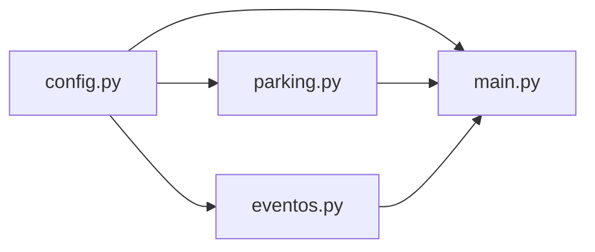
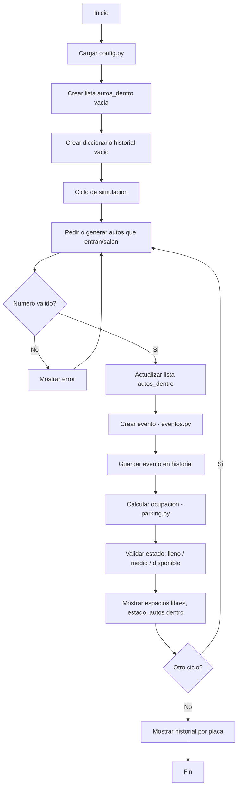

# Arquitectura del programa

## Dependencias entre archivos

## Flujo del programa

## Mapeo requisito / archivo

| # | Requisito | Archivo |
|---|-----------|---------|
| [1](./enunciado.md#L7) | Manejar datos (espacios, tarifa, placas) | `config.py` + `parking.py` + `eventos.py` |
| [2](./enunciado.md#L8) | Constantes y variables | `config.py` + `main.py` |
| [3](./enunciado.md#L9) | Calcular % ocupación | `parking.py` |
| [4](./enunciado.md#L10) | Validar lleno/medio/disponible | `parking.py` |
| [5](./enunciado.md#L11) | Usuario o random indica autos entran/salen | `main.py` |
| [6](./enunciado.md#L12) | Mostrar espacios libres | `parking.py` + `main.py` |
| [7](./enunciado.md#L13) | Manejar errores valores inválidos | `main.py` |
| [8](./enunciado.md#L14) | Lista de placas estacionadas | `main.py` |
| [9](./enunciado.md#L15) | Mostrar todos los autos dentro | `main.py` |
| [10](./enunciado.md#L16) | Tupla evento (placa, hora, tarifa) | `eventos.py` |
| [11](./enunciado.md#L17) | Diccionario placa, historial | `eventos.py` |
| [12](./enunciado.md#L18) | README.md | `README.md` |
